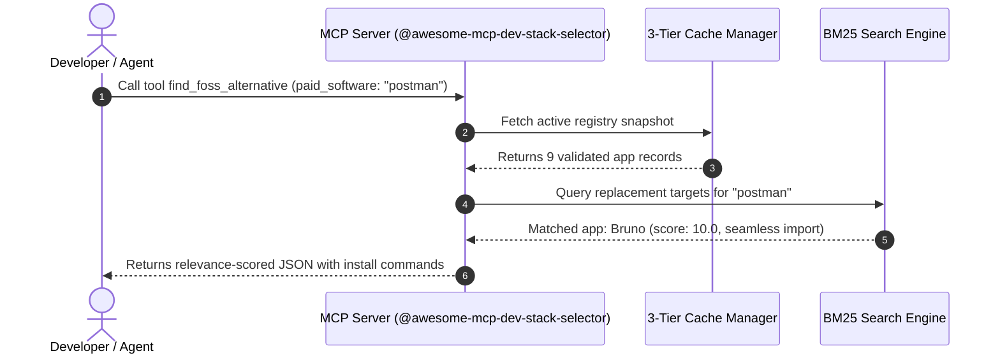

<p align="center">
  
</p>

<h1 align="center">awesome-mcp-dev-stack-selector</h1>

<p align="center">
  <b>Machine-Readable Free & Open-Source Software (FOSS) Registry & Zero-Latency MCP Server for AI Coding Agents</b>
</p>

<p align="center">
  <a href="https://awesome-mcp-dev-stack-selector.github.io"></a>
  <a href="https://github.com/awesome-mcp-dev-stack-selector/awesome-mcp-dev-stack-selector/actions"></a>
  <a href="https://modelcontextprotocol.io"></a>
  <a href="LICENSE"></a>
  <a href="#-apps-directory-9-verified-entries"></a>
</p>

---

## 🌐 Live Web Application & Catalog

Visit the interactive GitHub Pages site: **[awesome-mcp-dev-stack-selector.github.io](https://awesome-mcp-dev-stack-selector.github.io)**
* 🔍 **Live Search & Filter**: Instant filtering by platform, capabilities, and categories.
* 🔄 **Commercial Alternative Finder**: Type any paid tool (e.g. Postman, Notion, Photoshop) to view FOSS recommendations.
* ⚡ **MCP Tool Execution Playground**: Interactively simulate MCP tool stdio payloads directly in the browser!

---

## ⚡ Quickstart: Add MCP Server to your AI Agent

Run the server zero-install directly using `npx`:

```json
{
  "mcpServers": {
    "dev-stack-selector": {
      "command": "npx",
      "args": ["-y", "@awesome-mcp-dev-stack-selector/mcp-server"]
    }
  }
}
```

---

## 🛠️ MCP Surfaces & AI Tool Showcase



### Available MCP Tools

* **`search_free_apps`**: Search free/FOSS software by query, capability (`offline-editing`, `local-llm`), platform, or category.
* **`get_app_details`**: Get full metadata, license status, and install commands for any app ID (e.g., `bruno`, `vscodium`, `ollama`).
* **`find_foss_alternative`**: Locate FOSS replacements for proprietary commercial software (e.g. Postman, Notion, Photoshop, Docker Desktop).

---

## 📚 Apps Directory (9 Verified Entries)

### 🛠️ Developer Tools & IDEs

| App | License | Tagline | Capabilities | Replaces | One-Line Install |
| --- | --- | --- | --- | --- | --- |
| [**Bruno**](https://www.usebruno.com) | `MIT` | Fast, offline-first, Git-friendly open-source API client | `offline-editing` `git-versioning` `scripting` | ~postman~, ~insomnia~ | `brew install bruno` |
| [**DBeaver Community**](https://dbeaver.io) | `Apache-2.0` | Free multi-platform database tool for developers and DBAs | `sql-editor` `schema-visualizer` `data-export` | ~datagrip~, ~navicat~ | `brew install dbeaver-community` |
| [**VSCodium**](https://vscodium.com) | `MIT` | Free and open-source binaries of VS Code without telemetry or tracking | `extension-marketplace` `integrated-terminal` `git-integration` | ~vscode~ | `brew install vscodium` |

### 🤖 Local AI & LLM Tools

| App | License | Tagline | Capabilities | Replaces | One-Line Install |
| --- | --- | --- | --- | --- | --- |
| [**LM Studio**](https://lmstudio.ai) | `Proprietary-Free` | Discover, download, and run local LLMs offline on Mac, Windows, and Linux | `local-llm` `gui-chat` `model-downloader` | ~chatgpt-desktop~ | `brew install lm-studio` |
| [**Ollama**](https://ollama.com) | `MIT` | Get up and running with Llama 3, Mistral, and other large language models locally | `local-llm` `openai-api` `gpu-acceleration` | ~openai-api~ | `brew install ollama` |

### 🐳 Container & Infrastructure

| App | License | Tagline | Capabilities | Replaces | One-Line Install |
| --- | --- | --- | --- | --- | --- |
| [**PocketBase**](https://pocketbase.io) | `MIT` | Open Source backend in 1 file with real-time database, auth, and file storage | `realtime-subscriptions` `user-auth` `file-storage` | ~firebase~ | `brew install pocketbase` |
| [**Podman**](https://podman.io) | `Apache-2.0` | Daemonless, rootless open-source container engine | `container-runtime` `rootless-containers` `pod-management` | ~docker-desktop~ | `brew install podman` |

### 🎨 Design & Media Production

| App | License | Tagline | Capabilities | Replaces | One-Line Install |
| --- | --- | --- | --- | --- | --- |
| [**GIMP**](https://www.gimp.org) | `GPL-3.0-or-later` | GNU Image Manipulation Program - Free & open source image editor | `raster-editing` `layer-management` `plugin-support` | ~photoshop~ | `brew install gimp` |
| [**Inkscape**](https://inkscape.org) | `GPL-3.0-or-later` | Professional vector graphics editor for Linux, Windows and macOS | `vector-editing` `svg-native` `bezier-curves` | ~adobe-illustrator~ | `brew install inkscape` |

---

## 🤝 Contributing an App

We welcome community pull requests!
1. Add your JSON file in `apps/<category>/<app-id>.json` adhering to [`schema/app.schema.json`](schema/app.schema.json).
2. Run `npm run test` to validate locally.
3. Open a Pull Request — GitHub Actions will validate and compile automatically!

---

## 📄 License

MIT © 2026 Awesome MCP Dev Stack Selector Maintainers
