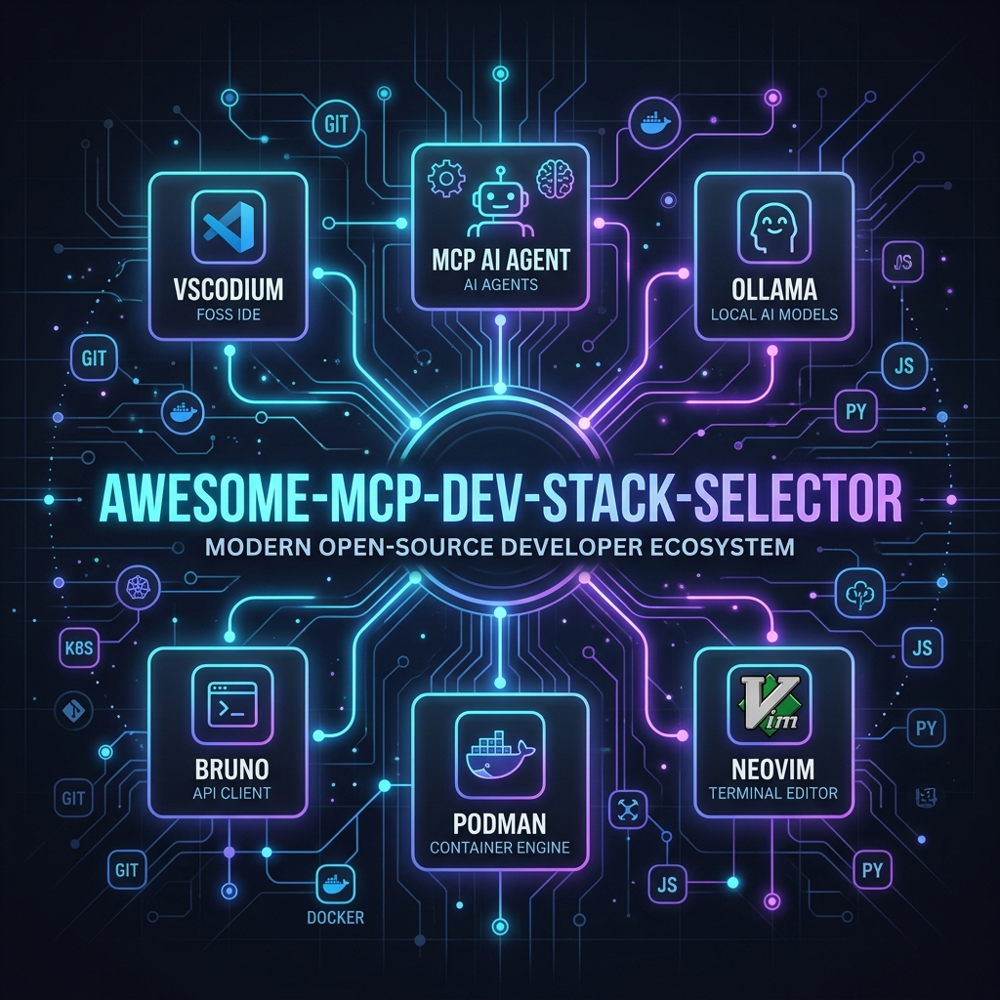
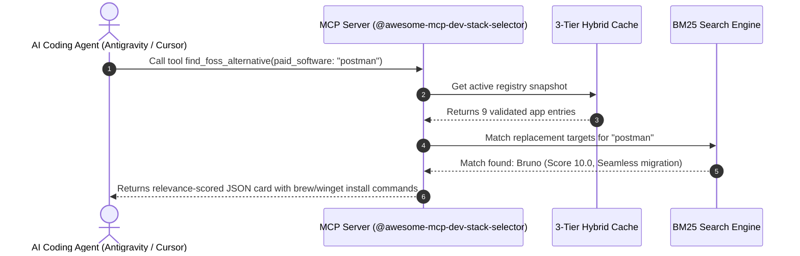
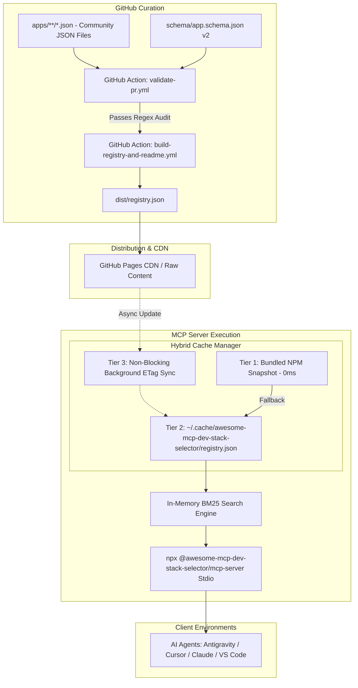

<p align="center">
  
</p>

<h1 align="center">awesome-mcp-dev-stack-selector</h1>

<p align="center">
  <b>Machine-Readable Free & Open-Source Software (FOSS) Registry & Zero-Latency MCP Server for AI Coding Agents</b>
</p>

<p align="center">
  <a href="https://awesome-mcp-dev-stack-selector.github.io"></a>
  <a href="https://github.com/awesome-mcp-dev-stack-selector/awesome-mcp-dev-stack-selector/actions"></a>
  <a href="https://modelcontextprotocol.io"></a>
  <a href="LICENSE"></a>
  <a href="#-apps-directory-20-verified-entries"></a>
</p>

---

## 🚀 Executive Summary & Value Proposition

Traditional "Awesome" markdown lists on GitHub are **static text documents**: they suffer from dead links, unverified command lines, lack of machine readability, and zero contextual utility inside modern AI coding workflows.

`awesome-mcp-dev-stack-selector` bridges crowd-sourced community curation with AI developer tooling by providing an **interactive Model Context Protocol (MCP) server** and **live catalog web application**.

### 🌟 Key Value Highlights

* ⚡ **0ms Zero-Latency Cold Start**: Starts instantly in **0ms** using a Tier-1 NPM package bundled snapshot, backed by local disk caching and non-blocking background ETag sync.
* 🤖 **AI-Agent Context Native**: Allows **Antigravity, Cursor, Claude Desktop, VS Code, and Windsurf** to query tools, read resources, and execute workflow prompts directly inside agent loops.
* 🛡️ **Supply-Chain Command Sanitization**: All community PRs undergo strict Regex validation in CI to eliminate malicious shell command injection risks (`brew install`, `winget install`).
* 🔍 **BM25 & Capability Search**: In-memory relevance engine capable of matching natural language query intents like *"offline vector editor capable of SVG export"*.
* 🔄 **FOSS Commercial Replacement Mapping**: Instant mapping from proprietary commercial software (Postman, Notion, Photoshop, Docker Desktop, Firebase) to verified open-source alternatives.

---

## 🌐 Live Web Application & Catalog

Experience the interactive web app hosted on GitHub Pages: **[awesome-mcp-dev-stack-selector.github.io](https://awesome-mcp-dev-stack-selector.github.io)**

* 🔍 **Live Real-time Filtering**: Filter by category, operating system (`macOS`, `Windows`, `Linux`), capabilities, and 100% offline usability.
* 🔄 **Interactive Commercial Replacement Finder**: Instant search for proprietary software replacements.
* ⚡ **MCP Tool Execution Playground**: Interactive browser simulator for testing MCP stdio tool payloads in real-time!

---

## ⚡ Agent Setup & Configuration

Add the MCP server to your AI coding environment zero-install using `npx`:

### 1. Antigravity & Claude Desktop

Add to `claude_desktop_config.json` or Antigravity MCP Settings:

```json
{
  "mcpServers": {
    "dev-stack-selector": {
      "command": "npx",
      "args": ["-y", "@awesome-mcp-dev-stack-selector/mcp-server"]
    }
  }
}
```

### 2. Cursor IDE

Go to **Settings ➔ Features ➔ MCP** and add a new MCP Server:
* **Name**: `dev-stack-selector`
* **Type**: `command`
* **Command**: `npx -y @awesome-mcp-dev-stack-selector/mcp-server`

### 3. VS Code / Windsurf

Add to your workspace `.mcp.json`:

```json
{
  "mcpServers": {
    "dev-stack-selector": {
      "command": "npx",
      "args": ["-y", "@awesome-mcp-dev-stack-selector/mcp-server"]
    }
  }
}
```

---

## 🛠️ Complete MCP Interface Specification

`awesome-mcp-dev-stack-selector` implements the full **Model Context Protocol (MCP)** specification across Tools, Resources, and Prompts:



### 1. MCP Tools Surface (Executable Functions)

#### 🔹 `search_free_apps`
Search free/FOSS software using natural language keywords, category, platform, or capability flags.
* **Parameters**:
  * `query` *(string, optional)*: Keyword, app name, or capability (e.g. `offline-editing`, `local-llm`).
  * `platform` *(string, optional)*: `macOS` | `Windows` | `Linux`
  * `category` *(string, optional)*: `developer-tools` | `ai-tools` | `container-infra` | `design-media` | `productivity`
  * `capability` *(string, optional)*: Specific capability requirement (e.g. `git-versioning`).
  * `offline_only` *(boolean, optional)*: Filter for apps usable 100% offline.

* **Example Payload**:
```json
{
  "total_found": 1,
  "apps": [
    {
      "id": "bruno",
      "name": "Bruno",
      "tagline": "Fast, offline-first, Git-friendly open-source API client",
      "license": "MIT",
      "website": "https://www.usebruno.com",
      "capabilities": ["offline-editing", "git-versioning", "scripting"],
      "replaces": ["postman", "insomnia"],
      "installation": { "macOS": "brew install bruno", "Windows": "winget install Bruno.Bruno" },
      "security_verified": true,
      "relevance_score": "10.00"
    }
  ]
}
```

#### 🔹 `get_app_details`
Retrieve complete metadata, license status, self-hosting configurations, and migration notes for a specific app ID.
* **Parameters**:
  * `app_id` *(string, required)*: Unique identifier of the app (e.g. `bruno`, `vscodium`, `ollama`, `podman`).

#### 🔹 `find_foss_alternative`
Locate FOSS/free replacements for commercial proprietary software with migration difficulty and import capability assessment.
* **Parameters**:
  * `paid_software` *(string, required)*: Name of commercial software to replace (e.g. `postman`, `vscode`, `photoshop`, `docker-desktop`, `firebase`).

---

### 2. MCP Resources Surface (Read-only Context Loading)

AI Agents can read structured dataset resources directly into context without invoking tool steps:

* **`devstack://registry`**: Returns the complete aggregated application registry JSON.
* **`devstack://categories`**: Returns structured taxonomy breakdown with entry counts per category.
* **`devstack://app/{id}`**: Direct entity URI lookup for individual apps (e.g. `devstack://app/bruno`).

---

### 3. MCP Prompts Surface (Reusable Agent Workflows)

* **`audit_project_dependencies_for_foss`**:
  Scans workspace configuration files (`package.json`, `docker-compose.yml`) and prompts the AI agent to audit proprietary dependencies and suggest open-source replacements.
* **`recommend_open_source_stack`**:
  Prompts the AI agent to query the registry and recommend a 100% open-source software stack tailored to specific application requirements.

---

## ⚙️ Architecture & 3-Tier Offline Cache



### 3-Tier Caching Rationale
1. **Tier 1 (Bundled Snapshot)**: Ships compiled inside the NPM package so the MCP server initializes in **0ms** even with zero internet connectivity.
2. **Tier 2 (Disk Cache)**: Caches fetched registry datasets in `~/.cache/awesome-mcp-dev-stack-selector/registry.json` with a 24-hour TTL.
3. **Tier 3 (Background Sync)**: Issues non-blocking HTTP HEAD requests to GitHub Pages to check for dataset ETag changes without delaying tool execution.

---

## 📚 Apps Directory (20 Verified Entries)

### 🛠️ Developer Tools & IDEs

| App | License | Tagline | Capabilities | Replaces | One-Line Install |
| --- | --- | --- | --- | --- | --- |
| [**Bruno**](https://www.usebruno.com) | `MIT` | Fast, offline-first, Git-friendly open-source API client | `offline-editing` `git-versioning` `scripting` | ~postman~, ~insomnia~ | `brew install bruno` |
| [**DBeaver Community**](https://dbeaver.io) | `Apache-2.0` | Free multi-platform database tool for developers and DBAs | `sql-editor` `schema-visualizer` `data-export` | ~datagrip~, ~navicat~ | `brew install dbeaver-community` |
| [**Hoppscotch**](https://hoppscotch.io) | `MIT` | Open Source API Development Ecosystem | `self-hosting` `web-based` `graphql-client` | ~postman~ | `brew install --cask hoppscotch` |
| [**VSCodium**](https://vscodium.com) | `MIT` | Free and open-source binaries of VS Code without telemetry or tracking | `extension-marketplace` `integrated-terminal` `git-integration` | ~vscode~ | `brew install vscodium` |

### 🤖 Local AI & LLM Tools

| App | License | Tagline | Capabilities | Replaces | One-Line Install |
| --- | --- | --- | --- | --- | --- |
| [**AnythingLLM**](https://anythingllm.com) | `MIT` | Full-Stack Desktop AI Assistant & Local RAG | `local-llm` `document-indexing` `vector-search` | ~custom-gpt~ | `brew install --cask anythingllm` |
| [**Jan**](https://jan.ai) | `AGPL-3.0` | Rethinking the AI Desktop Client | `local-llm` `offline-usable` `openai-api-compatibility` | ~chatgpt-desktop~ | `brew install --cask jan` |
| [**LM Studio**](https://lmstudio.ai) | `Proprietary-Free` | Discover, download, and run local LLMs offline on Mac, Windows, and Linux | `local-llm` `gui-chat` `model-downloader` | ~chatgpt-desktop~ | `brew install lm-studio` |
| [**Ollama**](https://ollama.com) | `MIT` | Get up and running with Llama 3, Mistral, and other large language models locally | `local-llm` `openai-api` `gpu-acceleration` | ~openai-api~ | `brew install ollama` |

### 🐳 Container & Infrastructure

| App | License | Tagline | Capabilities | Replaces | One-Line Install |
| --- | --- | --- | --- | --- | --- |
| [**K3s**](https://k3s.io) | `Apache-2.0` | Lightweight Kubernetes for Local & Edge Environments | `container-orchestration` `lightweight-runtime` `self-hosting` | ~docker-desktop~ | `brew install k3d` |
| [**OpenTofu**](https://opentofu.org) | `MPL-2.0` | Open Source Infrastructure as Code Engine | `infrastructure-as-code` `declarative-state` `multi-cloud` | ~terraform~ | `brew install opentofu` |
| [**PocketBase**](https://pocketbase.io) | `MIT` | Open Source backend in 1 file with real-time database, auth, and file storage | `realtime-subscriptions` `user-auth` `file-storage` | ~firebase~ | `brew install pocketbase` |
| [**Podman**](https://podman.io) | `Apache-2.0` | Daemonless, rootless open-source container engine | `container-runtime` `rootless-containers` `pod-management` | ~docker-desktop~ | `brew install podman` |

### 🎨 Design & Media Production

| App | License | Tagline | Capabilities | Replaces | One-Line Install |
| --- | --- | --- | --- | --- | --- |
| [**GIMP**](https://www.gimp.org) | `GPL-3.0-or-later` | GNU Image Manipulation Program - Free & open source image editor | `raster-editing` `layer-management` `plugin-support` | ~photoshop~ | `brew install gimp` |
| [**Inkscape**](https://inkscape.org) | `GPL-3.0-or-later` | Professional vector graphics editor for Linux, Windows and macOS | `vector-editing` `svg-native` `bezier-curves` | ~adobe-illustrator~ | `brew install inkscape` |
| [**Penpot**](https://penpot.app) | `MPL-2.0` | Open Source Design & Prototyping Platform | `self-hosting` `web-based` `vector-editing` | ~figma~ | `docker run -it --rm penpot/backend:latest` |

---

## 🛡️ Supply-Chain Safety & CI Governance

Community pull requests submitting new apps in `apps/**/*.json` must adhere to strict security guardrails:

* **Schema Validation**: Verified against JSON Schema draft 2020-12 using Ajv.
* **Safe Installation Command Regex**: Package manager installation strings are strictly validated against approved patterns (`brew install [a-z0-9-]+`, `winget install [A-Za-z0-9\.-]+`, `snap install [a-z0-9-]+`).
* **Forbidden Operators**: Shell chaining operators (`&&`, `;`, `||`, backticks, subshells) are strictly forbidden to protect developer environments against Remote Code Execution (RCE).
* **3-Strike Circuit Breaker Audit**: Nightly health checks require 3 consecutive failures over 48 hours before marking an app `degraded`, preventing false positives.

---

## 🤝 Contributing an App

We welcome community pull requests!
1. Add a JSON file in `apps/<category>/<app-id>.json` following [`schema/app.schema.json`](schema/app.schema.json).
2. Test locally using:
   ```bash
   npm run test
   ```
3. Open a Pull Request — GitHub Actions will run automated schema, security, and integration audits.

---

## 📄 License

MIT © 2026 Awesome MCP Dev Stack Selector Maintainers
