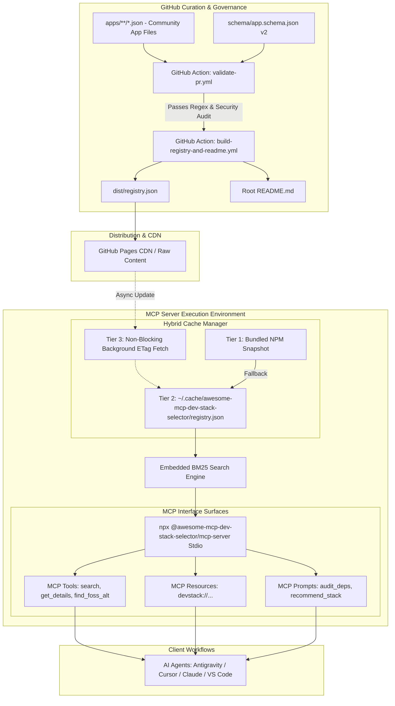

# Spec Design Document: MCP-Native Dev Stack Selector

**Date**: 2026-07-30  
**Version**: 2.0.0 (Architectural Refinement)  
**Status**: Approved Spec  
**Target Repository**: `awesome-mcp-dev-stack-selector` (GitHub-Native Community Registry & Multi-Capability MCP Server)  
**Architectural Lead**: Agency Software Architect  

---

## 1. Executive Summary & Value Proposition

`awesome-mcp-dev-stack-selector` is an open-source, GitHub-native software registry and Model Context Protocol (MCP) server. Traditional curated "Awesome" markdown lists suffer from broken links, unverified command lines, lack of machine readability, and zero contextual utility for modern AI-assisted software development.

This project bridges crowd-sourced community curation with AI developer tooling by providing:
1. **Machine-Readable Community Schema (v2)**: Validated, modular JSON files (`apps/**/*.json`) storing rich metadata, SPDX licensing, capability matrices, and migration pathways.
2. **Multi-Capability MCP Server**: A zero-dependency `npx` executable allowing AI coding agents (Antigravity, Cursor, Claude Desktop, VS Code, Windsurf) to query tools, read resources, and trigger workflow prompts directly inside agent loops.
3. **Hybrid 3-Tier Offline Cache**: Guaranteed zero-latency cold starts with automatic background sync and offline fallback resilience.
4. **Automated CI/CD Governance & Security Pipeline**: Automated PR validation, supply-chain command sanitization, static registry building, auto-rendered `README.md`, and circuit-breaker link auditing.

---

## 2. Weakness Analysis & Key Architectural Improvements

An architectural audit of the initial spec identified six critical vulnerabilities and structural gaps, resolved in v2.0:

| # | Domain | Identified Weakness / Vulnerability | Architectural Improvement in v2.0 |
|---|--------|------------------------------------|------------------------------------|
| 1 | **MCP Integration** | Underutilized MCP protocol (only 3 tools defined; zero resources or prompts). | Implemented full MCP spec: added 3 MCP Resources (`devstack://...`) and 2 MCP Prompts for context-native agent injection. |
| 2 | **Reliability & Cache** | Unspecified cache invalidation and single point of failure on remote fetch. | Introduced Hybrid 3-Tier Cache (NPM bundled fallback -> Local TTL disk cache -> Non-blocking ETag background sync). |
| 3 | **Supply-Chain Security** | Arbitrary shell installation strings (`brew`, `winget`) vulnerable to malicious PRs. | Implemented strict Regex command sanitization, domain allowlisting, and `security.verified` signatures. |
| 4 | **Search Precision** | Naive string matching missed semantic intent (e.g. capabilities, file formats). | Integrated local BM25 + Fuse.js fuzzy engine with structured capability and format indices. |
| 5 | **Data Granularity** | Generic `model: free_open_source` failed to capture SPDX licenses or migration details. | Upgraded to Schema v2 with SPDX license IDs, self-hosting Docker specs, and migration compatibility maps. |
| 6 | **Governance Resilience** | Transient HTTP errors in nightly health audits flooded repo with false positive issues. | Added a 3-strike circuit breaker over 48h before opening GitHub issues, plus `health_status` badge tracking. |

---

## 3. Architecture Decision Records (ADRs)

### ADR-001: Hybrid 3-Tier Offline-First Caching Strategy
* **Status**: Accepted
* **Context**: AI agents require instant MCP server initialization without waiting for remote network calls or risking failure during GitHub API rate limits / offline scenarios.
* **Decision**: Implement a 3-tier fallback resolution chain:
  1. *Tier 1 (Package Bundled)*: NPM package ships with a compiled snapshot of `dist/registry.json`.
  2. *Tier 2 (Disk Cache)*: `~/.cache/awesome-mcp-dev-stack-selector/registry.json` updated with a 24-hour TTL.
  3. *Tier 3 (Background Sync)*: Non-blocking HTTP HEAD request to GitHub Pages checks `ETag` / `Last-Modified` header. If updated, fetches delta in background without blocking current MCP response.
* **Consequences**: Zero-latency startup, 100% offline usability, zero rate limit impact on developer workflows.

### ADR-002: Exposing Complete MCP Capabilities (Tools, Resources, Prompts)
* **Status**: Accepted
* **Context**: Modern AI agents operate most efficiently when choosing between active tool calls (function execution), passive resource reads (context loading), and prompt templates.
* **Decision**: Expand MCP interface beyond basic tools:
  * **Tools**: `search_free_apps`, `get_app_details`, `find_foss_alternative`.
  * **Resources**: `devstack://registry` (complete database), `devstack://categories` (category taxonomy), `devstack://app/{id}` (individual entity URI).
  * **Prompts**: `audit_project_dependencies_for_foss`, `recommend_open_source_stack`.
* **Consequences**: Provides flexible integration patterns for both automated agent reasoning and interactive user workflows.

### ADR-003: Supply-Chain Safety & Command Sanitization
* **Status**: Accepted
* **Context**: Accepting open community PRs containing shell commands (`brew install ...`, `winget install ...`) introduces potential Remote Code Execution (RCE) or malicious package substitution risks when agents run these commands.
* **Decision**: Enforce strict CI governance:
  1. Installation strings MUST match strict whitelist regex rules (e.g. `^brew install [a-z0-9-]+$`, `^winget install [A-Za-z0-9\.]+$`). Shell chaining (`&&`, `;`, `\|`, `curl`) is explicitly forbidden.
  2. Download and repository URLs are checked against standard allowlists (GitHub, GitLab, Codeberg, official vendor domains).
  3. Introduce `security.verified_publisher` schema attribute set exclusively by repository maintainer sign-off.
* **Consequences**: Protects end-user developer machines and AI execution sandboxes from malicious command injection.

### ADR-004: Embedded In-Memory Search Engine (BM25 + Trigram Fuzzy)
* **Status**: Accepted
* **Context**: Simple text substring matching fails when agents search using natural language or domain concepts (e.g. "vector graphics editor compatible with SVG").
* **Decision**: Embed lightweight, zero-dependency in-memory search engine combining BM25 keyword scoring and Fuse.js fuzzy matching indexed on `name`, `tagline`, `description`, `tags`, `capabilities`, and `import_export_formats`.
* **Consequences**: Sub-millisecond response time with high relevance for conversational AI queries.

---

## 4. System Architecture & Data Flow



---

## 5. Component Specifications

### 5.1 Enhanced Data Schema (`schema/app.schema.json` v2)

Location: `apps/<category>/<app-id>.json`

```json
{
  "$schema": "https://json-schema.org/draft/2020-12/schema",
  "id": "bruno",
  "name": "Bruno",
  "tagline": "Fast and open-source offline-first API client",
  "description": "An open-source Git-friendly alternative to Postman and Insomnia. Stores collections directly in local project files.",
  "website": "https://www.usebruno.com",
  "repository": "https://github.com/usebruno/bruno",
  "license_spdx": "MIT",
  "category": "developer-tools",
  "tags": ["api-client", "postman-alternative", "rest", "graphql", "offline-first"],
  "capabilities": [
    "offline-editing",
    "git-versioning",
    "scripting",
    "environment-variables"
  ],
  "import_export_formats": [".json", ".bru", "postman-collection-v2"],
  "platforms": ["macOS", "Windows", "Linux"],
  "pricing": {
    "model": "free_open_source",
    "has_paid_tier": true,
    "paid_tier_description": "Optional Golden Edition for enterprise features"
  },
  "privacy": {
    "telemetry": false,
    "offline_usable": true,
    "cloud_sync_required": false
  },
  "self_hosting": {
    "supported": false
  },
  "installation": {
    "macOS": "brew install bruno",
    "Windows": "winget install Bruno.Bruno",
    "Linux": "snap install bruno"
  },
  "replaces": [
    {
      "target": "postman",
      "migration_ease": "seamless",
      "import_supported": true
    },
    {
      "target": "insomnia",
      "migration_ease": "moderate",
      "import_supported": true
    }
  ],
  "security": {
    "verified_publisher": true,
    "last_audit_date": "2026-07-30"
  },
  "health_status": "healthy"
}
```

---

### 5.2 Multi-Capability MCP Server Surface (`mcp-server/`)

The MCP server exposes three rich surface types via Stdio transport (`npx @awesome-mcp-dev-stack-selector/mcp-server`):

#### 1. MCP Tools Surface

##### `search_free_apps`
* **Description**: Search free/FOSS software using natural language, category, platform, or specific capability flags.
* **Parameters**:
  * `query` *(string, optional)*: Keyword or semantic query.
  * `platform` *(enum, optional)*: `macOS` | `Windows` | `Linux`
  * `category` *(string, optional)*: Target category.
  * `capability` *(string, optional)*: Required capability (e.g. `offline-editing`, `git-versioning`).
  * `offline_only` *(boolean, optional)*: Filter for offline-capable apps.

##### `get_app_details`
* **Description**: Retrieve complete metadata, installation commands, license status, and migration notes for a specific app ID.
* **Parameters**:
  * `app_id` *(string)*: Unique identifier of the app (e.g. `bruno`).

##### `find_foss_alternative`
* **Description**: Locate FOSS/free replacements for commercial proprietary software with migration difficulty and import capability assessment.
* **Parameters**:
  * `paid_software` *(string)*: Name of the commercial tool (e.g. `postman`, `notion`, `photoshop`).

---

#### 2. MCP Resources Surface

* **`devstack://registry`**: Returns the complete aggregated application registry in JSON format.
* **`devstack://categories`**: Returns structured breakdown of available categories, app counts, and top tags.
* **`devstack://app/{app_id}`**: Direct URI lookup for individual application entities.

---

#### 3. MCP Prompts Surface

* **`audit_project_dependencies_for_foss`**:
  * *Description*: Analyzes project configuration files (e.g., `package.json`, `Docker-compose.yml`) and prompts the agent to suggest open-source replacements for proprietary services.
* **`recommend_open_source_stack`**:
  * *Description*: Prompts the agent to recommend a complete open-source tech stack tailored to specified project requirements.

---

### 5.3 Automated CI/CD Governance & Security Pipeline

1. **`validate-pr.yml`**:
   * **Schema Checks**: Validates files against `app.schema.json` v2 using `ajv`.
   * **Command Injection Guardrail**: Asserts installation strings match approved safe command regexes.
   * **URL Verification**: Rejects unapproved domain origins or shortened URLs (`bit.ly`, `tinyurl`).
   * **Uniqueness Verification**: Guarantees unique `id` and repository entries across the codebase.

2. **`build-registry-and-readme.yml`**:
   * Compiles individual app JSON files into production distribution artifact `dist/registry.json`.
   * Generates clean, accessible root `README.md` containing dynamic tables, platform badges, and MCP setup documentation.
   * Deploys static bundle to GitHub Pages CDN.

3. **`nightly-health-audit.yml` (Circuit-Breaker Powered)**:
   * Periodically validates HTTP status codes for project websites and GitHub repositories.
   * Employs a 3-strike policy over 48 hours before marking `health_status: degraded` or opening automated GitHub triage issues.

---

## 6. Architectural Trade-off Analysis

| Concern | Simple Static List | MCP v1 Spec (Initial Draft) | MCP v2 Spec (Proposed Architecture) |
|---------|-------------------|----------------------------|-----------------------------------|
| **AI Agent Utility** | Low (Text parsing only) | Medium (Tools only) | **High (Tools + Resources + Prompts)** |
| **Offline Performance** | N/A | Low (Fails on network drops) | **High (3-Tier Hybrid Cache)** |
| **Supply-Chain Security** | None (Unchecked PRs) | Minimal | **High (Regex sanitization & Allowlisting)** |
| **Search Accuracy** | Low (Browser Ctrl+F) | Basic (Substrings) | **High (BM25 + Fuzzy + Capability Index)** |
| **Maintenance Overhead**| High (Manual edit conflicts) | Low (JSON files) | **Low (Fully automated CI/CD & Audits)** |

---

## 7. Verification & Testing Strategy

1. **Schema & Security Unit Testing**: Automated test suite executing `ajv` schema verification and safe command regex validation on fixture datasets.
2. **MCP Integration Suite**: Automated tests verifying Stdio responses for MCP Tools, Resources, and Prompts using official `@modelcontextprotocol/sdk`.
3. **Offline Caching Simulation**: Test suite enforcing complete offline execution (network mock disabled) to verify Tier-1 and Tier-2 cache fallback integrity.
4. **CI Build & Markdown Rendering Check**: Automated validation verifying that generated `README.md` and `dist/registry.json` maintain 100% data parity.
